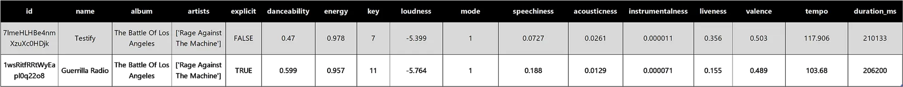
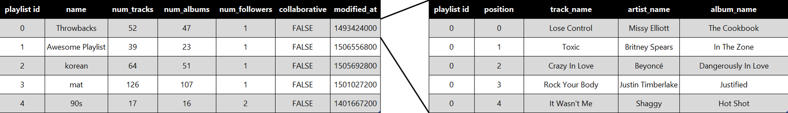
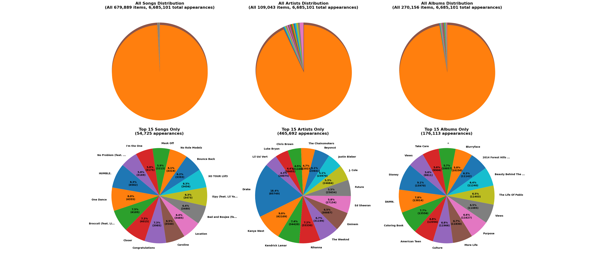
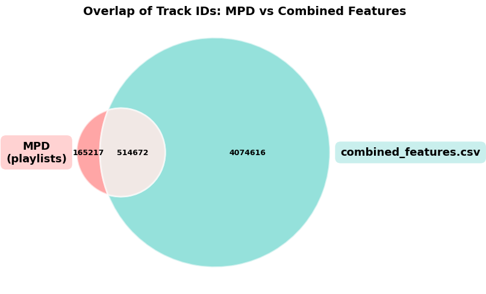
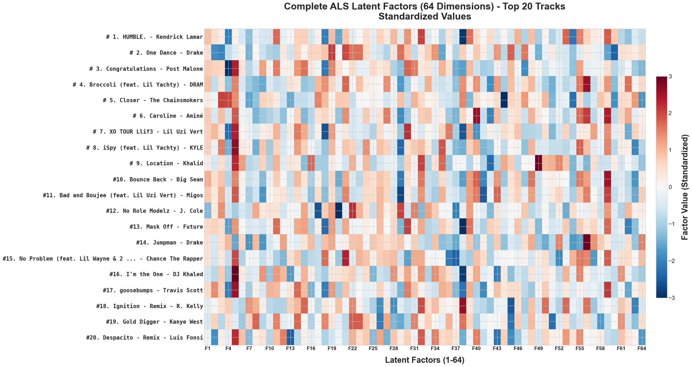
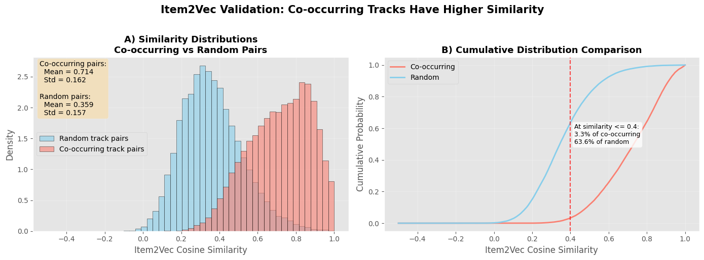

# 🎵 Hybrid Music Recommender System

[](https://www.python.org/downloads/)
[](https://streamlit.io/)
[](LICENSE)

A hybrid music recommendation system combining content-based filtering and collaborative filtering to deliver personalized song recommendations. Built on 515,000+ tracks from the Million Playlist Dataset and Spotify audio features.

<p align="center">
  
</p>

📖 **[Read the full technical writeup on Medium](https://medium.com/@kieransatheesan/hybrid-music-recommender-system-f9d4b55e8c0a)**

---

## 🎯 Overview

This project demonstrates how different recommendation approaches capture complementary aspects of musical similarity:

- **Content-Based (Audio Features)**: Captures how tracks *sound* through acoustic descriptors
- **Collaborative Filtering (ALS)**: Captures how tracks are *consumed together* in playlists  
- **Sequential Embeddings (Item2Vec)**: Captures how tracks *flow together* in listening sessions
- **Hybrid Fusion**: Combines all signals with tunable weights for balanced recommendations

The system is deployed as an interactive Streamlit app where users can adjust model weights in real-time to explore how recommendations shift between audio-driven and behavior-driven regimes.

---

## 🚀 Quick Start

### Installation
```bash
# Clone repository
git clone https://github.com/KieranSatheesan/Music_Recommender.git
cd Music_Recommender

# Install dependencies
pip install -r requirements.txt
```

### Download Data

Pre-processed data and trained models are available via [Google Drive](https://drive.google.com/drive/folders/YOUR_FOLDER_ID). Extract to:
- `data/processed/`
- `models/`

### Run the App
```bash
streamlit run app.py
```

The app will launch at `http://localhost:8501`

### (Optional) Add Spotify Integration

For album artwork display, create a `.env` file:
```bash
SPOTIFY_CLIENT_ID=your_client_id
SPOTIFY_CLIENT_SECRET=your_client_secret
```

---

## 📊 Dataset Construction

### Audio Features (4.7M+ tracks)

Multiple static datasets were combined to build a comprehensive audio feature corpus following Spotify's deprecation of public API access:

<p align="center">
  
</p>

After cleaning and deduplication, 4,589,288 unique tracks were retained across 13 audio features (danceability, energy, valence, tempo, etc.):

<p align="center">
  
</p>

### Million Playlist Dataset (1M playlists)

The [Spotify Million Playlist Dataset](https://www.aicrowd.com/challenges/spotify-million-playlist-dataset-challenge) provides rich behavioral data through user-generated playlists:

<p align="center">
  
</p>

The first 100,000 playlists were used for training, capturing both popular hits and long-tail content:

<p align="center">
  
</p>

### Hybrid Universe (515k tracks)

The intersection between audio features and MPD forms the hybrid recommendation space:

<p align="center">
  
</p>

Only tracks present in both datasets can leverage all recommendation signals simultaneously.

---

## 🏗️ Model Architecture

### Content-Based: k-NN in Feature Space

Tracks are embedded in 13-dimensional audio-feature space. Cosine similarity identifies acoustically similar tracks, prioritizing "shape of sound" over raw magnitude. This approach excels at discovering stylistically similar music across different artists.

### Clustering for Structure Discovery

**Track Clustering**: k-means partitioning reveals natural groupings by genre, instrumentation, and production style:

<p align="center">
  
</p>

**Playlist Clustering**: Aggregating features at playlist-level uncovers thematic coherence:

<p align="center">
  
</p>

<p align="center">
  
</p>

<p align="center">
  
</p>

Playlists naturally separate into semantic categories (Classical, Rap, Christmas, etc.) when represented by their mean audio characteristics.

### Collaborative: ALS Matrix Factorization

ALS learns 64-dimensional latent representations of playlists and tracks from co-occurrence patterns. Tracks with similar embeddings tend to appear in the same playlists, even if they sound different:

<p align="center">
  
</p>

This behavioral signal captures listener taste beyond acoustic similarity alone.

### Sequential: Item2Vec Embeddings

While ALS models *what* tracks co-occur, Item2Vec models *how* they flow together in sequences. Using Word2Vec's skip-gram architecture on playlist sequences, the model learns embeddings where tracks sharing similar listening contexts lie close together:

<p align="center">
  
</p>

Co-occurring tracks exhibit substantially higher similarity (0.714 vs 0.359) than random pairs, confirming meaningful sequential structure.

### Hybrid Fusion

The final hybrid score combines normalized signals through a weighted sum:
```
hybrid_score = α·cosine + β·ALS + γ·Item2Vec + δ·cluster_bonus
```

Users control weights (α, β, γ, δ) interactively to balance content-based and collaborative signals.

---

## 📈 Performance

Models were evaluated using next-song prediction on 500 held-out playlists:

| Model | HitRate@10 | Recall@10 | MAP@10 | NDCG@10 |
|-------|------------|-----------|---------|---------|
| **k-NN (Cosine)** | 0.016 | 0.003 | 0.008 | 0.012 |
| **ALS** | 0.580 | 0.034 | 0.312 | 0.342 |
| **Item2Vec** | 0.224 | 0.045 | 0.124 | 0.148 |

**Key Findings:**
- ALS achieves HitRate@50 ≈ 0.74, demonstrating strong co-occurrence signal
- Item2Vec provides better recall than ALS through sequential context
- Content-based methods ensure artist diversity but score lower on behavioral metrics
- Hybrid integration consistently outperforms individual approaches

While offline metrics guide model development, qualitative inspection through the interactive app revealed the hybrid system's ability to balance sonic coherence with behavioral relevance—producing recommendations that both "sound right" and "feel right" in context.

---

## 🎛️ Interactive Streamlit App

The interface exposes similarity weights as sliders, enabling real-time exploration of the recommendation space:

- **Audio slider**: Emphasize sonic similarity
- **Playlist co-occurrence slider**: Emphasize behavioral patterns
- **Sequence slider**: Emphasize track transitions
- **Cluster bonus slider**: Bonus for same-genre recommendations

Users can observe how recommendations shift from broad acoustic matches to narrow collaborative suggestions as weights change.

---

## 📁 Project Structure
```
Music_Recommender/
├── app.py                          # Streamlit application
├── recommender/                    # Core recommendation engine
│   ├── models.py                   # Model loading & initialization
│   └── hybrid.py                   # Hybrid scoring logic
├── src/                            # Data processing utilities
│   ├── build_features_dataset.py
│   ├── build_interactions.py
│   ├── build_track_metadata.py
│   └── recommender_helpers.py
├── notebooks/                      # Analysis notebooks (01-11)
│   ├── 01_feature_datasets.ipynb
│   ├── 02_mpd_dataset.ipynb
│   ├── ...
│   └── 11_hybrid.ipynb
├── data/
│   ├── raw/                        # Original datasets
│   └── processed/                  # Cleaned & merged data
└── models/                         # Trained model artifacts
```

---

## 📓 Notebooks

The `notebooks/` directory contains 11 Jupyter notebooks documenting the complete research and development process:

**Data Exploration (01-04)**: Dataset analysis, feature distributions, and overlap computation  
**Content-Based Methods (05-08)**: k-NN similarity, clustering in audio and playlist space  
**Collaborative Filtering (09-10)**: ALS matrix factorization and Item2Vec sequence embeddings  
**Hybrid System (11)**: Multi-signal integration and final evaluation

Each notebook tells a clear story in the progression from raw data to deployed system, with extensive visualizations and quantitative analysis.

---

## 🛠️ Technical Stack

**Core**: Python 3.9+, pandas, NumPy, scikit-learn  
**Collaborative Filtering**: implicit (ALS), gensim (Word2Vec)  
**Visualization**: Matplotlib, Seaborn  
**Web App**: Streamlit  
**APIs**: Spotify Web API (optional)

---

## 🔧 Usage Example
```python
from recommender import load_all_models, recommend_by_name_hybrid

# Load models (cached after first call)
models = load_all_models()

# Generate recommendations
seed, recommendations, _ = recommend_by_name_hybrid(
    query="ocean eyes",
    models=models,
    candidate_index=0,
    w_cos=0.35,      # Audio features
    w_als=0.30,      # ALS
    w_i2v=0.30,      # Item2Vec
    w_cluster=0.05,  # Cluster bonus
    top_k=20
)

print(recommendations[["track_name", "artist_name", "hybrid_score"]])
```

---

## 🚧 Future Directions

- Expand track universe to 1M+ through additional feature sources
- Implement neural collaborative filtering alternatives (NCF, autoencoders)
- Add explainability layer showing which signals drove each recommendation
- Deploy cloud-hosted version with user feedback loop
- Extend to playlist generation (multi-track seeding)

---

## 📚 References

- **Million Playlist Dataset**: Chen et al. (2018), RecSys Challenge 2018
- **ALS**: Hu et al. (2008), *Collaborative Filtering for Implicit Feedback Datasets*
- **Item2Vec**: Barkan & Koenigstein (2016), *Neural Item Embedding for Collaborative Filtering*

---

## 👤 Author

**Kieran Satheesan**

📧 [kieran.satheesan@example.com](mailto:kieran.satheesan@example.com)  
💼 [LinkedIn](https://linkedin.com/in/kieran-satheesan)  
📝 [Medium](https://medium.com/@kieransatheesan)  
🐙 [GitHub](https://github.com/KieranSatheesan)

---

## 📄 License

This project is licensed under the MIT License - see the [LICENSE](LICENSE) file for details.

---

## 🙏 Acknowledgments

- Spotify for audio analysis framework (archived datasets)
- RecSys Challenge 2018 for the Million Playlist Dataset
- Kaggle community for maintaining feature archives
- Ben Frederickson for the `implicit` library
- `gensim` team for Word2Vec/Item2Vec implementation

---

<div align="center">

**Built with 🎵 by Kieran Satheesan | 2025**

⭐ Star this repo if you found it useful!

</div>